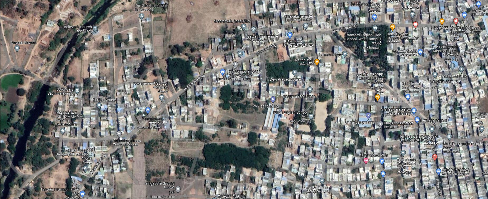
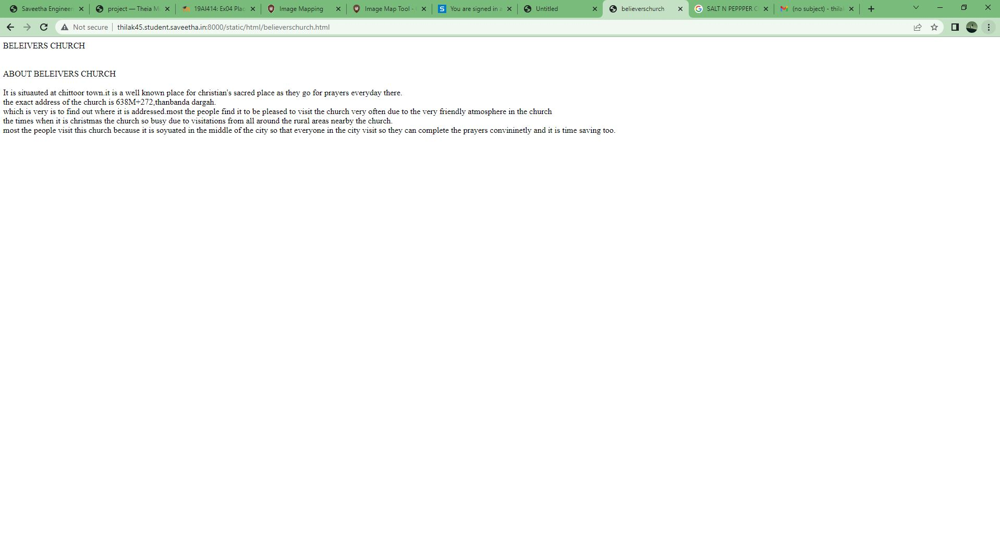
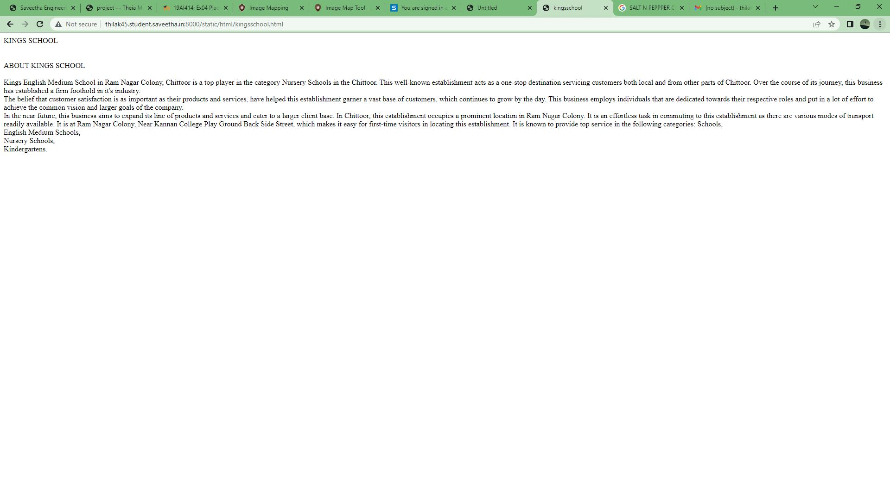
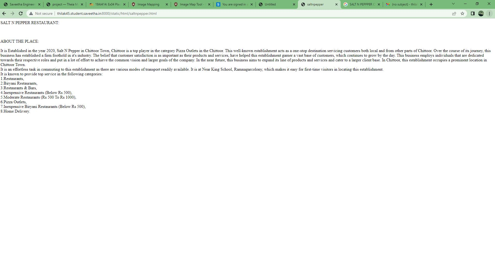
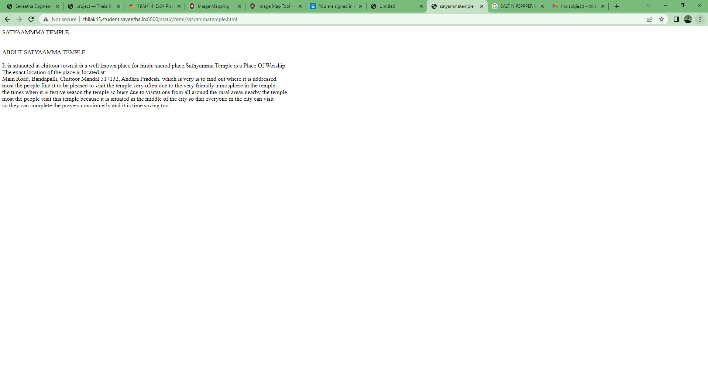
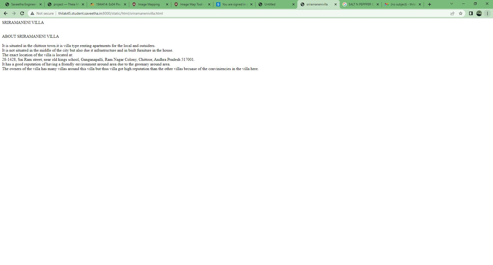

# Places Around Me
## AIM:
To develop a website to display details about the places around my house.

## Design Steps:

### Step 1:
create your area location map.
### Step 2:
add content to any 5 places around your area.
### step3:
complete the index work.
### excute:
excute the program.
## Code:
```html
<!DOCTYPE html>
<html>
    <head>
        <title>Places around me</title>
    </head>
    <body>
       
       <map name="image-maps-2023-07-24-025136" id="ImageMapsCom-image-maps-2023-07-24-025136">
       <area  alt="" title="saltnpepper" href="saltnpepper.html" shape="rect" coords="1405,294,1455,344" style="outline:none;" target="_self"     />
       <area  alt="" title="kingsschool" href="kingsschool.html" shape="rect" coords="1141,392,1191,442" style="outline:none;" target="_self"     />
       <area  alt="" title="satyatemple" href="satyammatemple.html" shape="rect" coords="934,121,984,171" style="outline:none;" target="_self"     />
       <area  alt="" title="sriramanenivilla" href="sriramanenivilla.html" shape="rect" coords="1374,574,1424,624" style="outline:none;" target="_self"     />
       <area  alt="" title="believerschurch" href="believerschurch.html" shape="rect" coords="337,96,387,146" style="outline:none;" target="_self"     />
       <area shape="rect" coords="1847,753,1849,755" alt="Image Map" style="outline:none;" title="Image Map" href="https://www.image-maps.com/" />
</map>
</map>
        </map>
    </body>
</html>
```

## Output:

## BELIEVERSCHURCH:

## KINGSSCHOOL:

## SALTNPEPPER:

## SATYAMMA TEMPLE:

## SRIRAMANENI VILLA:


## Result:
THE PROGRAM HAS EXCUTED SUCCESSFULLY.